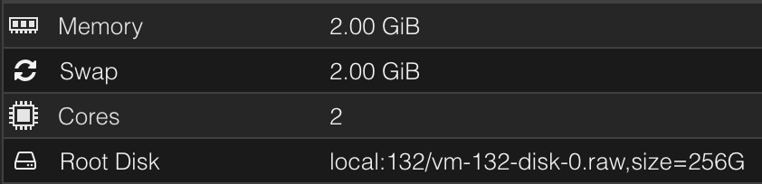

# Prøveeksamen
Prøveeksamen i driftstøtte, brukerstøtte og utvikling.

### Om prosjektet
<b>IP: http://172.20.128.85/Frontend/</b>

Programmet jeg skal lage er et krypterings-program. Brukeren kan velge mellom en liste av såkalte "koder". Disse kodene er det som brukes for å kryptere/dekryptere tekst. Brukeren kan skrive både ord, tall, symboler og hele setninger som skal brukes. De fleste symboler (inkludert mellomrom) vil bli ignorert i krypteringen. Brukerene får aldri se selve koden, men heller navnet som er tilgitt den tilhørende koden. I tillegg kan brukeren legge til en ny kode. Det gjør de ved å skrive inn et navn, og så vil den tilhørende koden bli tilfeldig generert av programmet.

Programmet bruker HTML og CSS for frontend koding, og JavaScript og PHP for backend koding. Programmet kjører på en Apache2 server, mens databasen kjører på en MariaDB server. I tillegg brukes det SQL i PHP scriptene, for å snakke med databasen.

### Filene
``index.html`` → Programmet bruker bare en HTML side, så det er denne siden brukeren alltid vil kunne se.

``styles.css`` → Generell CSS for HTML siden.

``main.js`` → All JavaScript ligger her. Det er her krypteringen og dekrypteringen blir gjort. I tillegg kalles flere av PHP scriptene gjennom JavaScript, i tillegg til at den gjør flere andre viktige funksjoner.

``newCode.php`` → PHP for å legge til en ny "kode" i databasen.

``getNames.php`` → PHP som henter alle navnene (som tilhører kodene) i databasen og lager en dropdown list med det.

``getCode.php`` → PHP som henter koden tilhørende det navnet brukeren har valgt.

### Spesifikasjoner
Hvilke spesifikasjoner du burde ha på serveren din for å kjøre programmet.

* Du trenger å sette opp en server.
* Serveren trenger Apache2 installert.
* Serveren trenger MariaDB eller MySQL installert.
* Det er anbefalt å laste ned git.
* Husk å endre permissions og starting directory etter hvordan du vil ha det
  * Du kan endre DocumentRoot i /etc/apache2/sites-available/000-default.conf for å endre startside
* Sett opp en database og table på SQL serveren
* Endre PHP filene med brukernavn, passord, adresse, databasenavn og tablenavn etter hva du har satt det til

  
## Brukertesting
1. Prøv å legg til en ny 'kode' med et selvvalgt navn.
2. Vises den opp i listen?
3. Velg en kode (et navn) og skriv inn noe du vil kryptere, deretter trykk submit.
4. Hva skjer?
5. Prøv å dekrypter det som ble skrevet ut *NB! Husk å velg den samme koden/navnet*
  
6. Hvordan var programmet å bruke?
7. Møtte du på noen problemer, eller funket alt som det skulle?
8. Hva kunne forbedres?

## Kilder

HTML, PHP, CSS og SQL - https://www.w3schools.com/

GitHub i Ubuntu - https://www.howtoforge.com/tutorial/install-git-and-github-on-ubuntu/

Apache2 - https://ubuntu.com/tutorials/install-and-configure-apache#1-overview

Testing mot SQL injection - https://owasp.org/www-project-web-security-testing-guide/latest/4-Web_Application_Security_Testing/07-Input_Validation_Testing/05-Testing_for_SQL_Injection

Hjelp med error fiksing og krypteringsfunksjonen - https://chat.openai.com/
